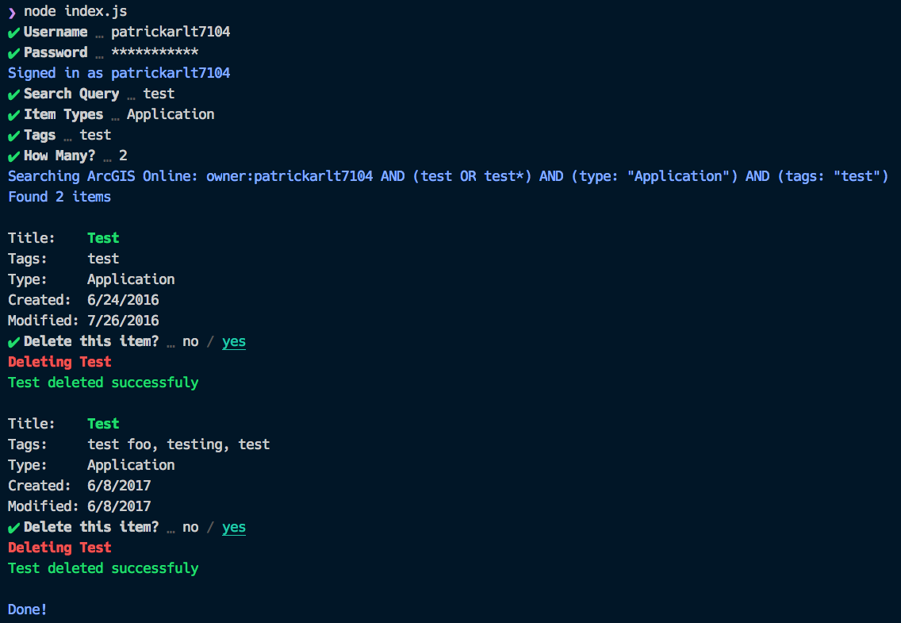

# Node JS CLI Item Management

Demo CLI application.

## Running this demo
1. Like all the other demo apps, run `npm run bootstrap` in the root directory.
2. `cd demos/node-cli-item-management`
3. `npm start`

